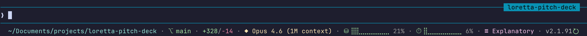

# claude-statusline

A compact, single-line statusline for [Claude Code](https://claude.com/claude-code) written in bash. Shows what's running, where you are, how much context is left, and whether a Claude Code update is waiting.

## Screenshot

.

## Features

- **Session ID auto-hide** — when a session is named (via `/rename`), the lavender `[id]` block is hidden since Claude Code already shows the name in its header. Only unnamed sessions show a truncated `[abc12345]` block as a reminder to name the session.
- **Update-ready indicator** — a green refresh arrow (`↻`) appears next to the version number when a newer Claude Code is installed than the one currently running. Detected by reading the versioned symlink target, no subprocess spawn.
- **Graceful degradation** — every element is conditional. If a field is missing from the input JSON (older Claude Code versions, pending data before the first API response, etc.), the section is silently skipped rather than showing `null` or `0`.
- **Color-coded progress bars** — braille block bars (`⣿⣀`) for context usage and the 5-hour rate window, green under 50%, yellow 50–79%, red 80% and up.
- **Pace-aware rate tracking** — the 5-hour bar appends a `⇡N%` (red, over-pace) or `⇣N%` (green, under-pace) delta comparing your actual burn rate to linear time-proportional use. 60% used with 4h left means something very different than 60% used with 30 minutes left; the delta surfaces that gap. Inspired by [claude-pace](https://github.com/Astro-Han/claude-pace).
- **Single-pass jq extraction** — one `jq` invocation pulls all fields, avoiding the ~20-process fan-out of naive scripts.
- **Cached git branch** — 5-second TTL so `git symbolic-ref` doesn't run on every statusline tick.
- **Terminal-safe output** — leading and trailing ANSI resets prevent color bleed into surrounding content, no trailing newline (Claude Code counts newlines to determine row count).

## Statusline Elements

From left to right, each element is separated by a dim `·`:

| Element | Example | Color | Notes |
| --- | --- | --- | --- |
| **Session ID** | `[abc12345]` | lavender | Only when session is unnamed. First 8 chars of the session UUID. |
| **Directory** | `~/Documents/projects` | cyan | Home directory is abbreviated to `~`. |
| **Git branch** | `⎇ main` | green | Only when inside a git repo. Falls back to short commit SHA if HEAD is detached. |
| **Lines changed** | `+35/-31` | green / red | Session total of lines added and removed by the model. |
| **Model** | `◆ Opus 4.6` | yellow | `Claude` prefix is stripped for compactness. |
| **Context usage** | `⛁ ⣿⣿⣀⣀⣀⣀⣀⣀⣀⣀ 23%` | green / yellow / red | Percent of the context window consumed by the current conversation. Shows `⛁ --` before the first API response. |
| **5-hour window** | `⏱ ⣿⣀⣀⣀⣀⣀⣀⣀⣀⣀ 8% ⇣10% 3h` | green / yellow / red | Percent of the 5-hour rate limit used. Claude Pro/Max only. Shows `⏱ --` before the first API response. Appends a pace delta and reset countdown when `resets_at` is present — see below. |
| **Pace delta** | `⇡15%` / `⇣15%` | red / green | How far ahead or behind you are vs. linear burn-through of the 5-hour window. `⇡N%` (red) = overspending, slow down. `⇣N%` (green) = headroom. Hidden when `|delta|` < 3% to reduce noise. |
| **Reset countdown** | `3h` / `45m` | grey | Time remaining in the current 5-hour window. Renders as `Xh` when ≥ 60 minutes, else `Xm`. Always shown when `resets_at` is present. |
| **Output style** | `☰Explanatory` | magenta | Hidden when the style is `default`. Shows when you're in Learning, Explanatory, or a custom style. |
| **Effort level** | `effort:high` | grey | Only when an effort level is set. |
| **Vim mode** | `vim:NORMAL` | grey | Only when vim mode is active. |
| **Claude Code version** | `v2.1.101` | dim white | Always shown when available. Appends a green `↻` when a newer version is installed. |

### Progress bar thresholds

Both progress bars use the same 10-block braille display and color thresholds:

- **Green** — 0–49% (healthy)
- **Yellow** — 50–79% (watch)
- **Red** — 80–100% (act soon)

## Setup

### Prerequisites

- Bash 4+ (macOS ships with 3.2 — use `brew install bash` if you want full feature support; the script works on 3.2 too)
- `jq` installed and on your `PATH`
- [Claude Code](https://claude.com/claude-code) installed
- A font with braille block glyphs (most modern monospaced fonts include them — confirmed working in Ghostty, iTerm2, WezTerm, Alacritty)

### Install

```sh
# Clone somewhere permanent
git clone https://github.com/tedserbinski/claude-code-statusline.git ~/claude-statusline

# Point Claude Code at the script
```

Add (or edit) the `statusLine` block in `~/.claude/settings.json`:

```json
{
  "statusLine": {
    "type": "command",
    "command": "bash ~/claude-statusline/statusline-command.sh"
  }
}
```

Restart Claude Code (or open a new session) and the statusline should appear at the bottom of the terminal.

### Testing

A test suite covering 20 scenarios (full payloads, boundary values, missing fields, rapid redraws, performance) is included:

```sh
bash ~/claude-statusline/test-statusline.sh
```

Expected output ends with `All 20 tests passed ✓`. If any test fails, the output line count or stderr leakage is almost always the cause — see the "Troubleshooting" section below.

## Customization

All the meaningful knobs are in the top of `statusline-command.sh`:

- **Colors** — the `C_CYAN`, `C_GREEN`, etc. variables at lines 7–14 use standard ANSI 16-color codes and 256-color escapes. Swap in your own palette.
- **Bar width** — `build_bar`'s default total is 10 blocks (line 18). Lower it for more compact bars, raise it for more granularity.
- **Usage thresholds** — the 50% / 80% color break points live in `build_bar` and `pct_color_val` (lines 22–33). Change them if you want different warning levels.
- **Git cache TTL** — defaults to 5 seconds (line ~54). Raise it if your repo is huge and git calls are slow.
- **Pace noise threshold** — `PACE_THRESHOLD=3` (search for it). Hides `⇡`/`⇣` deltas smaller than this percentage. Lower to see micro-drifts, raise to only flag serious over/under-pacing.

## How the Update Indicator Works

The script detects an installed-but-not-running Claude Code update by comparing two version strings:

1. **Running version** — read from the `version` field of the JSON payload that Claude Code pipes to the script's stdin.
2. **Installed version** — read from the target of the `claude` binary symlink. Claude Code's installer creates `~/.local/bin/claude` as a symlink pointing at `~/.local/share/claude/versions/<version>/`, so the version number is literally the last path component of the symlink target.

Reading the symlink is a single `readlinkat()` syscall (<1ms), so it runs on every tick with no cache — keeping it cache-free means the indicator disappears immediately when Claude Code auto-updates mid-session.

If the running and installed versions differ, `update_available` is set and a green `↻` is appended to the version display in the statusline.

Note that the symlink approach only works for Claude Code installed via the native installer. If you installed through a package manager (Homebrew, npm global), `claude` may not be a symlink and the update indicator will silently do nothing.

## Troubleshooting

**Statusline appears twice in the terminal or leaks into scrollback.** This is a known Claude Code rendering bug ([issue #17519](https://github.com/anthropics/claude-code/issues/17519)) affecting iTerm2 and Ghostty. It's caused by the React Ink renderer not fully clearing the old statusline position during content reflow. Not fixable from the script side.

**Tests fail with multi-line output.** If the test suite reports `LINE COUNT: 2 lines (expected 1)`, something is emitting to stderr. Common cause: a jq type error on an unexpected field shape. Run the script manually with a sample payload and `2>&1 | cat -v` to see the error.

**Progress bars show `⛁ --` and `⏱ --` instead of percentages.** This is normal before the first API response in a new session — the `context_window.used_percentage` and `rate_limits.five_hour.used_percentage` fields aren't populated yet. The bars will fill in after your first message.

**Version doesn't show.** The `version` field in the JSON payload was added in a recent Claude Code release. Older versions don't send it, and the script silently skips the section.

**Update indicator never appears.** Check that `~/.local/bin/claude` is a symlink: `readlink ~/.local/bin/claude`. If it returns an absolute path containing the version, the indicator should work. If it returns nothing or the file isn't a symlink, you likely installed Claude Code through a package manager and the detection won't work.

## Design Notes

- **Single jq call** — extracting 11 fields in one `jq -r '@sh ...'` call and using `eval` to assign them is roughly 10x faster than the naive `var=$(echo "$input" | jq -r '.foo')` pattern repeated per field.
- **Variable-based helpers instead of subshell capture** — `build_bar` writes to a global `_bar_result` variable instead of echoing, so callers don't incur a subshell per call. This matters because subshell stdout capture can interleave ANSI escape sequences across buffer boundaries in rare cases.
- **Leading ANSI reset** — every output line starts with `\033[0m` to override Claude Code's ambient dim styling. Pattern borrowed from [ccstatusline](https://github.com/sirmalloc/ccstatusline).
- **No trailing newline** — Claude Code counts `\n` characters to determine how many rows the statusline occupies. An extra newline at the end is counted as a second row, which breaks layout math on some versions.

## Credits and References

- Braille progress bar style inspired by [pranav2012's statusline](https://github.com/pranav2012) and various community examples.
- Simple repo to share inspired by [levz0r's claude-code-statusline](https://github.com/levz0r/claude-code-statusline/)
- ANSI handling and leading-reset pattern borrowed from [sirmalloc/ccstatusline](https://github.com/sirmalloc/ccstatusline).
- Single-jq-call optimization pattern borrowed from [martinemde/starship-claude](https://github.com/martinemde/starship-claude).
- Pace delta concept (⇡/⇣ over-/under-pace tracking vs. linear window burn-through) borrowed from [Astro-Han/claude-pace](https://github.com/Astro-Han/claude-pace).
- Official Claude Code statusline docs: <https://code.claude.com/docs/en/statusline>

## License

MIT

## Author

Created with ♥ by Ted Serbinski for better Claude Code sessions.
